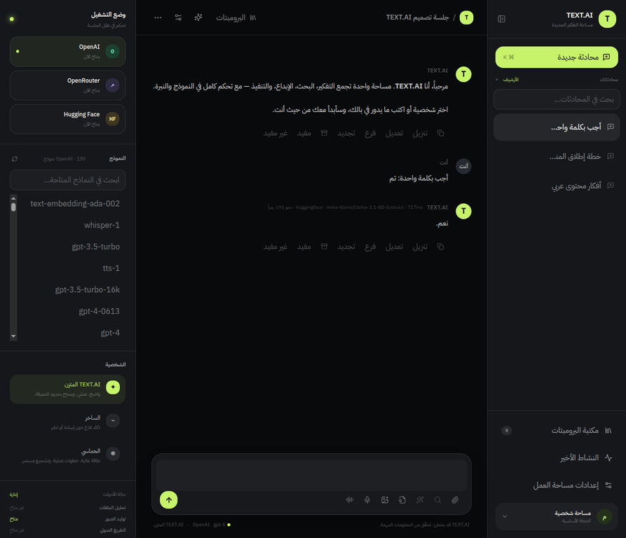

# TEXT.AI

<p align="center">
  <strong>مساحة عربية موحّدة للتفكير، البحث، الإبداع والتنفيذ بالذكاء الاصطناعي</strong>
</p>

<p align="center">
  <a href="https://wolfaiom-text-ai-3.hf.space/"></a>
  <a href="https://github.com/AZDriveai/text-ai-3/actions"></a>
  <a href="https://github.com/AZDriveai/text-ai-3"></a>
  <a href="https://github.com/AZDriveai/text-ai-3/blob/main/LICENSE"></a>
</p>

> **TEXT.AI** مساحة عمل عربية RTL للمحادثة مع نماذج الذكاء الاصطناعي، تجمع اختيار المزود والنموذج، إدارة المحادثات، الأدوات متعددة الوسائط، مكتبة البرومبتات، المقارنة بين النماذج، واكتشاف النماذج المتاحة من مفاتيح الخادم في واجهة واحدة.

## لقطة من الواجهة

توضح الصورة التالية مساحة العمل أثناء التشغيل، بما في ذلك الشريط الجانبي للمحادثات، اختيار المزود والنموذج، مساحة المحادثة، وشريط كتابة الرسائل.



<p align="center"><sub>واجهة RTL الفعلية أثناء التشغيل: الشريط الجانبي، النماذج، المحادثة، والأدوات في مساحة واحدة.</sub></p>

## روابط سريعة

| الرابط | الوجهة |
|---|---|
| **النسخة الحية** | [wolfaiom-text-ai-3.hf.space](https://wolfaiom-text-ai-3.hf.space/) |
| **المستودع** | [AZDriveai/text-ai-3](https://github.com/AZDriveai/text-ai-3) |
| **سجل الجودة** | [`docs/QA_30_TOOLS_2026-09-01.md`](docs/QA_30_TOOLS_2026-09-01.md) |
| **السياسات** | [`docs/policies/policies_text_ai.json`](docs/policies/policies_text_ai.json) |
| **التواصل** | `wolfonlyoman@gmail.com` · واتساب: `+968 9464 2987` |

## فهرس المحتوى

[فكرة المشروع](#فكرة-المشروع) · [الحالة الحالية](#الحالة-الحالية) · [المزايا الرئيسية](#المزايا-الرئيسية) · [المعمارية](#المعمارية) · [الأدوات الثلاثون](#الأدوات-الثلاثون) · [التثبيت والتشغيل المحلي](#التثبيت-والتشغيل-المحلي) · [متغيرات البيئة](#متغيرات-البيئة) · [الاختبارات والتحقق](#الاختبارات-والتحقق) · [النشر](#النشر) · [الأمان والخصوصية](#الأمان-والخصوصية) · [التواصل](#التواصل)

## فكرة المشروع

صُمم TEXT.AI ليكون طبقة عمل موحدة فوق مزودي النماذج المتوافقين مع واجهة OpenAI-compatible. بدلاً من ربط الواجهة مباشرة بكل مزود، تمر طلبات المحادثة واكتشاف النماذج عبر الخادم. وبذلك تبقى مفاتيح API خارج المتصفح، ويمكن للمستخدم تبديل المزود أو النموذج من مساحة العمل دون تغيير بنية التطبيق.

التطبيق لا يقدّم قائمة نماذج ثابتة بوصفها حقيقة دائمة. عند تشغيل الخادم أو تحديث قائمة النماذج، يقرأ الخادم المفاتيح المهيأة، يطلب `/v1/models` من كل مزود، يطبع النماذج القابلة للاكتشاف، ثم يعرضها في الواجهة مع حالة المزود وعدد النماذج. إذا تعذر الوصول إلى مزود، تظهر حالة واضحة بدلاً من إخفاء الخطأ أو الادعاء بأن النموذج متاح.

## الحالة الحالية

تم التحقق من نسخة المشروع في بيئة التشغيل المحلية بتاريخ **2026-09-01**. يعرض الجدول أدناه لقطة تحقق تاريخية لاختبار اكتشاف النماذج؛ الأعداد ديناميكية وقد تتغير في أي وقت. أما النسخة المنشورة حالياً فتعمل على Hugging Face Spaces، وقد نجح فيها اختبار محادثة عربي فعلي عبر Hugging Face.

| المزود | متغير البيئة | عدد النماذج وقت التحقق | حالة الاختبار |
|---|---|---:|---|
| OpenAI | `OPENAI_API_KEY` | 130 | متاح |
| OpenRouter | `OPENROUTER_API_KEY` | 425 | متاح |
| Hugging Face | `HF_TOKEN` أو `HUGGINGFACE_API_KEY` | 136 | متاح |

الأعداد السابقة **ديناميكية** وليست جزءاً ثابتاً من التطبيق؛ قد تتغير حسب حساب المستخدم، صلاحية المفتاح، وسياسة المزود وقائمة النماذج الحالية.

## المزايا الرئيسية

| المجال | ما يقدمه TEXT.AI |
|---|---|
| المحادثة | إرسال محادثات متعددة الأدوار إلى OpenAI أو OpenRouter أو Hugging Face، مع عرض المزود والنموذج والمدة وتقدير الرموز. |
| اكتشاف النماذج | قراءة قائمة النماذج مباشرة من المزود، البحث داخل القائمة، التبديل بين المزودين، واستخدام بديل آمن عند غياب نموذج محدد. |
| إدارة المحادثات | إنشاء محادثة، إنشاء عنوان تلقائي من أول رسالة، البحث، التثبيت، الأرشفة، الاستعادة، إعادة التسمية، الحذف، واستعادة آخر محادثة نشطة. |
| الأدوات | كتالوج من 30 أداة منظماً إلى وسائط، وكلاء وأتمتة، دردشة وبيئة عمل، برمجة وتطوير، وبحث ومعرفة. |
| الوسائط | رفع المرفقات، تحليل المحتوى المرئي والنصي، توليد الصور، تفريغ الصوت، وتلخيص التفريغ عند توفر التكامل المناسب. |
| الإنتاجية | مكتبة برومبتات، متغيرات قابلة للتعبئة، مقارنة جانبية بين نموذجين، تعديل وإعادة إرسال، إعادة توليد، تفريع، حفظ المخرجات، وتصدير مساحة العمل. |
| التخصيص | شخصيات TEXT.AI المتزن والساخر والحماسي، عمق التفكير، حجم الخط، التباين، تقليل الحركة، ووضع داكن/فاتح/نظام. |
| اللغة وإتاحة الاستخدام | واجهة عربية RTL، تسميات وصول للأزرار، حالات تحميل وخطأ، شريط جانبي متجاوب، وإغلاق النوافذ المنبثقة بزر Escape. |

## المعمارية

التطبيق مقسم إلى طبقات واضحة حتى لا تعتمد الواجهة على أسرار المزودين أو تفاصيل HTTP الخاصة بهم.

```text
المتصفح React + Vite
        |
        | tRPC عبر client/src/lib/trpc.ts
        v
خادم Express + tRPC
        |
        +--> providerRouting.ts
        |       +--> اكتشاف /v1/models
        |       +--> إرسال /v1/chat/completions
        |       +--> تحويل البرومبتات والمرفقات
        |
        +--> storage.ts / S3-compatible storage للمرفقات
        +--> imageGeneration.ts لتوليد الصور
        +--> voiceTranscription.ts لتفريغ الصوت
        +--> Drizzle + MySQL/TiDB عند تفعيل التخزين الدائم
```

### تدفق اكتشاف النماذج

1. تستدعي الواجهة الإجراء `ai.providerModels` عبر tRPC.
2. يمر الخادم على المزودين المسجلين في `server/providerRouting.ts`.
3. يبحث عن المفتاح في أسماء البيئة الخاصة بالمزود. يدعم Hugging Face كلاً من `HF_TOKEN` و`HUGGINGFACE_API_KEY`.
4. يرسل الخادم طلب GET يحتوي على `Authorization: Bearer ...` إلى نقطة `/v1/models`.
5. تُطبّع الاستجابة إلى عناصر من الشكل `{ id, name?, ownedBy? }` مع إزالة المكرر.
6. تُعاد الحالة لكل مزود، وتشمل `available` و`models` ورسالة خطأ آمنة عند الحاجة.
7. تعرض الواجهة المزود المتاح، العدد الحالي، مربع البحث، النموذج المحدد، وحالة التحديث.

### تدفق المحادثة

عند إرسال الرسالة، تتحقق الواجهة من وجود نص أو مرفق، ثم ترسل إلى الإجراء `ai.chat` المزود والنموذج ومعرف قالب البرومبت وسجل الرسائل. يبني الخادم تعليمات النظام الخاصة بـ TEXT.AI، يضيف سياق المرفقات المدعومة، ثم يرسل الطلب إلى نقطة المحادثة الخاصة بالمزود. بعد وصول الاستجابة، تحفظ الواجهة الرسالة والبيانات الوصفية، وتعرض المزود والنموذج وزمن الاستجابة وتقدير عدد الرموز.

المفاتيح لا تُعاد إلى العميل ولا تُضمّن في استجابة اكتشاف النماذج. العميل يتلقى حالة منطقية وقائمة معرفات النماذج فقط.

## الأدوات الثلاثون

الكتالوج موجود في `shared/toolCatalog.ts`، ولكل أداة معرف رقمي، اسم، تصنيف، وصف، نوع إجراء، ومفاتيح لازمة. حالة الأداة تعتمد على توفر جميع مفاتيحها المطلوبة؛ لذلك لا يتم عرض أداة غير مهيأة على أنها جاهزة فعلياً.

| التصنيف | الأدوات |
|---|---|
| فيديو ووسائط | Omni-Video-Factory، Wan2.2 / Wan2.1 Web UI، Open-Sora 2.0 Web UI، LTX-2 Web Interface، ComfyUI Web Portal، OpenRouter Video API |
| وكلاء وأتمتة | Dify.ai، OpenClaw، Hermes Agent، Flowise، Langflow، n8n AI Workflows، GPT Researcher |
| دردشة وبيئة عمل | LibreChat، LobeChat، TypingMind، Open WebUI، AnythingLLM، Jan.ai Hybrid UI، big-AGI، SillyTavern، NextChat |
| برمجة وتطوير | Cline، Roo Code، Kilo Code، Cursor Web Integrations، Tabby |
| بحث ومعرفة | Perplexica، Khoj، HF Inference Playground |

هذه القائمة هي **كتالوج تكاملات ومتطلبات** داخل TEXT.AI. وجود اسم الأداة لا يعني أن التطبيق يثبت خدمة خارجية أو يشغّل مستودعاً خارجياً تلقائياً؛ الواجهة تعرض المسار، متطلبات المفتاح، وحالة الجاهزية بصدق.

## بنية الملفات المهمة

| المسار | المسؤولية |
|---|---|
| `client/src/pages/Home.tsx` | مساحة العمل الرئيسية، المحادثات، الشريط الجانبي، النوافذ، المُركّب، اختيار المزود والنموذج، والأفعال التفاعلية. |
| `client/src/components/ModernToolsPanel.tsx` | كتالوج الأدوات الثلاثين، البحث والتصفية، وعرض حالة المتطلبات. |
| `client/src/index.css` | نظام الألوان، RTL، الوضع الداكن والفاتح، الحالات التفاعلية، والتخطيط المتجاوب. |
| `client/src/lib/trpc.ts` | عميل tRPC المستخدم من الواجهة. |
| `server/routers.ts` | عقود إجراءات tRPC للمحادثة، النماذج، الصور، الصوت، المرفقات، والقوالب. |
| `server/providerRouting.ts` | قراءة المفاتيح، اكتشاف النماذج، بناء الرسائل، وإرسال طلبات المحادثة. |
| `server/_core/env.ts` | تحميل متغيرات البيئة وفق اتفاقية الخادم. |
| `server/_core/imageGeneration.ts` | تكامل توليد الصور. |
| `server/_core/voiceTranscription.ts` | تكامل تفريغ الصوت. |
| `shared/toolCatalog.ts` | تعريف الأدوات الثلاثين ومتطلبات مفاتيحها. |
| `shared/promptTemplates.ts` | قوالب البرومبت وتعليمات هوية TEXT.AI حسب المزود. |
| `scripts/check-providers.sh` | فحص آمن يطبع حالة المزود وعدد النماذج دون طباعة المفاتيح. |
| `docs/QA_30_TOOLS_2026-09-01.md` | سجل فحص الواجهة، الأدوات، النماذج، الثيمات، وأزرار التفاعل. |
| `docs/QA_MOBILE_DRAWER_2026-09-01.md` | تحقق تخطيط الشريط الجانبي على الشاشات الصغيرة. |
| `docs/QA_MODERN_FEATURES.md` | تحقق الميزات الحديثة مثل المقارنة والحفظ والتصدير. |
| `docs/huggingface-deployment-notes.md` | سجل إصلاحات النشر ونتيجة اختبار Space الحي. |
| `docs/policies/policies_text_ai.json` | سياسة الاستخدام والخصوصية والأمان والتواصل بصيغة JSON. |

## المتطلبات

يحتاج المشروع إلى Node.js حديث، و`pnpm`، ومفاتيح المزودين الذين تريد استخدامهم. لا يشترط تفعيل جميع المفاتيح؛ التطبيق يعمل بالمزودين المهيئين فقط، وتظهر بقية المزودين كغير مهيأة.

| المكوّن | الغرض |
|---|---|
| Node.js | تشغيل الخادم وأدوات البناء. |
| pnpm | تثبيت الحزم وتشغيل أوامر المشروع. نسخة مدير الحزم المحددة في `package.json` هي pnpm 10.4.1. |
| MySQL/TiDB | التخزين الدائم عند تفعيل وظائف قاعدة البيانات في بيئة النشر. |
| S3-compatible storage | تخزين المرفقات عند تفعيل تسجيل الدخول والتخزين. |
| مفاتيح المزودين | اكتشاف النماذج وإرسال طلبات المحادثة. |

## التثبيت والتشغيل المحلي

```bash
git clone https://github.com/AZDriveai/text-ai-3.git
cd text-ai-3
pnpm install --frozen-lockfile
cp .env.example .env  # إذا كان ملف المثال متاحاً في بيئتك
pnpm dev
```

يفتح الخادم عادةً واجهة التطوير على العنوان الذي يطبعه Vite في الطرفية. في بيئة التحقق المحلية كان الموقع متاحاً عبر `http://localhost:4173/`.

لتشغيل نسخة الإنتاج:

```bash
pnpm build
pnpm start
```

## متغيرات البيئة

ضع المفاتيح في `.env` محلياً أو في مدير أسرار بيئة النشر. لا تضع القيم الحقيقية في GitHub ولا في كود العميل.

| المتغير | الاستخدام | إلزامي؟ |
|---|---|---|
| `OPENAI_API_KEY` | اكتشاف نماذج OpenAI وإرسال محادثات OpenAI. | اختياري بحسب المزود المطلوب |
| `OPENROUTER_API_KEY` | اكتشاف نماذج OpenRouter وإرسال محادثات OpenRouter. | اختياري بحسب المزود المطلوب |
| `HF_TOKEN` | اكتشاف نماذج Hugging Face وإرسال محادثات Hugging Face. | اختياري بحسب المزود المطلوب |
| `HUGGINGFACE_API_KEY` | اسم بديل يقبله مسار Hugging Face للتوافق مع البيئات الموجودة. | اختياري |
| `DATA_PROVIDER_API_KEY` | تفعيل البحث المتصل والبحث العميق عند وجود موصل بيانات فعلي. | اختياري |
| `BUILT_IN_FORGE_API_KEY` | مصدر بديل لحالة البحث الأساسية في بيئات Manus المتوافقة. | اختياري |
| متغيرات قاعدة البيانات والتخزين | تستخدمها طبقة المشروع عند تفعيل الحسابات والتخزين الدائم. | حسب بيئة النشر |

يمكن فحص مفاتيح المزودين دون كشف قيمها:

```bash
set -a
. ./.env
set +a
./scripts/check-providers.sh
```

يعرض الفحص حالة HTTP وعدد النماذج فقط، مثل:

```text
OpenAI: status=200 models=130
OpenRouter: status=200 models=425
Hugging Face: status=200 models=136
```

## إجراءات الخادم المتاحة

تُعرّف الإجراءات في `server/routers.ts` وتُستهلك من الواجهة عبر tRPC.

| الإجراء | النوع | الوظيفة |
|---|---|---|
| `ai.providerStatus` | Query عامة | يعيد حالة وجود مفتاح لكل مزود دون قيمة المفتاح. |
| `ai.providerModels` | Query عامة | يكتشف النماذج المتاحة من المزودين. |
| `ai.dataProviderStatus` | Query عامة | يحدد جاهزية البحث المتصل والبحث العميق. |
| `ai.chat` | Mutation عامة | يرسل سجل محادثة إلى المزود والنموذج المحددين. |
| `ai.analyzeContent` | Mutation عامة | يرسل مرفقات مدعومة إلى مسار التحليل. |
| `ai.generateImage` | Mutation عامة | يطلب توليد صورة من وصف. |
| `ai.transcribeAudio` | Mutation محمية | يفرغ مرفقاً صوتياً بعد تسجيل الدخول. |
| `ai.summarizeTranscript` | Mutation عامة | يلخص نص التفريغ عبر مسار المحادثة. |
| `ai.uploadAttachment` | Mutation محمية | يرفع المرفق إلى التخزين مع حد حجم آمن. |
| `ai.promptTemplates` | Query عامة | يعيد قوالب البرومبت، مع تصفية اختيارية حسب المزود. |
| `ai.preparePrompt` | Query عامة | يبني تعليمات النظام النهائية للمعاينة أو التصحيح. |

## بيئات النشر وسير العمل

يحتوي المستودع على ثلاث بيئات GitHub Actions بأسماء مخصصة تتضمن `3z` داخل الاسم:

| البيئة | الغرض | طريقة التشغيل |
|---|---|---|
| `develo3zpment` | فحص وتجربة التغييرات الأولية. | اختيار البيئة من التشغيل اليدوي لسير العمل. |
| `sta3zging` | التحقق قبل الإنتاج بعد نجاح الفحوصات. | تشغيل يدوي مع حماية بيئة اختيارية من إعدادات GitHub. |
| `produc3ztion` | تجهيز نسخة الإنتاج بعد الموافقة النهائية. | تشغيل يدوي مع إمكانية إضافة موافقات أو أسرار خاصة بالبيئة. |

سير العمل الموجود في `.github/workflows/deploy-environments.yml` يعمل عبر `workflow_dispatch`، ويطلب اختيار البيئة، ثم يربط الوظيفة بالبيئة المختارة. كما يضم المستودع `.github/workflows/node-ci.yml` كسير عمل التكامل المستمر المناسب لهذا المشروع؛ وهو مبني على Node.js وpnpm لأن المشروع يستخدم React/Vite في الواجهة وExpress/TypeScript في الخادم، وليس npm أو Jekyll أو Azure أو AWS مباشرة. قبل إنتاج artifact، ينفذ الخطوات التالية بالترتيب: تثبيت Node.js وpnpm، تثبيت الاعتماديات باستخدام `--frozen-lockfile`، فحص TypeScript، تشغيل اختبارات Vitest، بناء نسخة الإنتاج، ثم رفع مجلد `dist/` كـ artifact مؤقت مرتبط برقم commit.

لا يحتوي سير العمل على أسرار أو قيم API داخل المستودع. يمكن إضافة أسرار خاصة بكل بيئة من إعدادات **Settings → Environments** في GitHub، وسيتم حقنها أثناء التشغيل فقط إذا احتاجت خطوة نشر مستقبلية إليها. حالياً يركز سير العمل على التحقق والبناء الآمن، ولا يدّعي نشر التطبيق إلى منصة استضافة غير مهيأة.

## الاختبارات والتحقق

يشغّل المشروع فحص الأنواع واختبارات Vitest وبناء الإنتاج من خلال الأمر الموحد:

```bash
pnpm check
pnpm vitest run
pnpm build
# أو
pnpm validate
```

تشمل التغطية الحالية اختبارات توجيه المزودين، أسماء مفاتيح البيئة، اكتشاف النماذج، كتالوج الأدوات الثلاثين، قوالب البرومبت، المقارنة، الحفظ المحلي، الخصوصية، المحادثات، المرفقات، الصور، الصوت، اختصارات لوحة المفاتيح، وحالات الواجهة.

تم تنفيذ فحص متصفح تفاعلي شمل فتح كتالوج الأدوات وتصفية التصنيفات واختيار أداة، تبديل المزود، البحث في قائمة النماذج، فتح الإعدادات، تغيير الثيم، فحص تخطيط RTL، وإرسال رسالة عربية حقيقية إلى نموذج Hugging Face. كما تمت إضافة دعم إغلاق النوافذ المنبثقة بزر Escape وبالنقر على الخلفية، وإزالة آخر زر واجهة غير موصول بفعل.

## الأمان والخصوصية

المبدأ الأساسي هو **لا مفاتيح في العميل**. جميع طلبات المزودين تخرج من الخادم، بينما يعرض العميل حالات منطقية وقوائم نماذج فقط. ملف `.env` مستبعد في `.gitignore`، ولا ينبغي تجاوز ذلك الاستبعاد عند تجهيز commit.

المرفقات تمر عبر تحقق من النوع والحجم، وتستخدم مراجع تخزين بدلاً من تضمين محتوى غير محدود في سجل المحادثة. وظائف التخزين الدائم ورفع المرفقات والتفريغ الصوتي محمية بحسب حالة تسجيل الدخول. أدوات التصدير والتنظيف المحلي توضح للمستخدم أن البيانات المحلية تختلف عن بيانات الخادم.

قبل مشاركة أي سجل أو تصدير، راجع محتوى المحادثة والمرفقات. لا تضع أسراراً أو رموز وصول في البرومبتات أو لقطات الشاشة أو ملفات الاختبار.

## النشر

للنشر في بيئة إنتاج، ثبّت الاعتماديات من ملف القفل، عرّف متغيرات البيئة في مدير الأسرار، شغّل `pnpm build`، ثم شغّل `pnpm start`. يجب تمرير متغيرات البيئة إلى عملية الخادم فقط. إذا احتجت إلى الحسابات أو التخزين الدائم، فعّل قاعدة البيانات والتخزين المتوافقين مع إعدادات المشروع قبل تشغيل ميزات المرفقات والتاريخ الدائم.

### النشر الحالي على Hugging Face Spaces

النسخة العامة الحالية منشورة كـ Docker Space على [wolfaiom-text-ai-3.hf.space](https://wolfaiom-text-ai-3.hf.space/). يستخدم Docker المنفذ `7860`، ويُحقن `HF_TOKEN` من Space Secrets، بينما تُقرأ المفاتيح داخل الخادم فقط. في آخر تحقق، كانت الحالة `RUNNING`، واكتشف الخادم **134 نموذجاً** من Hugging Face، ونجح طلب عربي فعلي إلى `meta-llama/Llama-3.1-8B-Instruct` بزمن استجابة يقارب 690ms.

لإعادة النشر، ادفع التغييرات إلى فرع `main` ثم راقب سجل البناء والتشغيل في مساحة Hugging Face. لا تُرفع الأسرار إلى GitHub أو إلى ملفات Docker أو إلى حزمة الواجهة.

لا تضع `dist/` أو `node_modules/` أو `.env` في المستودع. يعتمد البناء على فصل حزمة الواجهة بواسطة Vite وحزمة الخادم بواسطة esbuild.

## استكشاف الأخطاء

| العرض | السبب المحتمل | الإجراء |
|---|---|---|
| المزود يظهر «غير مهيأ» | المفتاح غير موجود في بيئة الخادم أو اسمه غير صحيح. | تحقق من اسم المتغير ثم أعد تشغيل الخادم. استخدم `scripts/check-providers.sh`. |
| المزود متاح لكن القائمة فارغة | رفض المزود الطلب أو أعاد استجابة غير متوافقة. | راجع حالة HTTP وسجل الخادم، ولا تعرض المفتاح في السجل. |
| النموذج المحدد اختفى بعد التحديث | قائمة المزود ديناميكية أو تغيرت صلاحية النموذج. | اختر نموذجاً من القائمة الحالية؛ التطبيق يستخدم fallback آمناً عند الحاجة. |
| البحث غير متاح | لا يوجد `DATA_PROVIDER_API_KEY` أو موصل بحث فعلي. | هذا سلوك مقصود، ولا يتم عرض بحث حي دون تكامل صالح. |
| المرفق لا يُرفع | المستخدم غير مسجل، النوع غير مدعوم، أو الحجم يتجاوز الحد. | تحقق من تسجيل الدخول والنوع والحجم، ثم أعد المحاولة. |
| فشل `pnpm install --frozen-lockfile` | اختلاف نسخة pnpm أو تغير ملف القفل. | استخدم نسخة pnpm المحددة في `package.json` ولا تعدل القفل يدوياً. |

## السياسات

يضم المستودع وثيقة منفصلة بصيغة JSON في [`docs/policies/policies_text_ai.json`](docs/policies/policies_text_ai.json)، وتغطي **الاستخدام المقبول، الخصوصية، الأمان، التعامل مع المفاتيح، المرفقات، التواصل، والإبلاغ عن المشكلات**. هذه الوثيقة مكملة لهذا README وليست بديلاً عن شروط مزودي النماذج أو الخدمات الخارجية.

## التواصل

مالك المشروع: **Abdulaziz Al-Hamdani**. للاستفسارات أو بلاغات المشكلات، استخدم البريد [wolfonlyoman@gmail.com](mailto:wolfonlyoman@gmail.com) أو واتساب عبر الرقم **+968 9464 2987**. عند إرسال بلاغ، أرفق خطوات إعادة المشكلة ولقطة شاشة منزوعة الأسرار ورقم commit إن أمكن.

## الترخيص

المشروع يعلن ترخيص **MIT** في `package.json`. راجع متطلبات تراخيص أي نموذج أو خدمة خارجية قبل استخدامها في الإنتاج؛ ترخيص TEXT.AI لا يغيّر شروط مزودي النماذج أو المستودعات الخارجية.

## المراجع

1. [OpenAI API documentation](https://platform.openai.com/docs/overview)
2. [OpenRouter API documentation](https://openrouter.ai/docs/api-reference/overview)
3. [Hugging Face Inference Providers documentation](https://huggingface.co/docs/inference-providers/index)
4. [tRPC documentation](https://trpc.io/docs)
5. [Vite documentation](https://vite.dev/guide/)
6. [Vitest documentation](https://vitest.dev/guide/)
